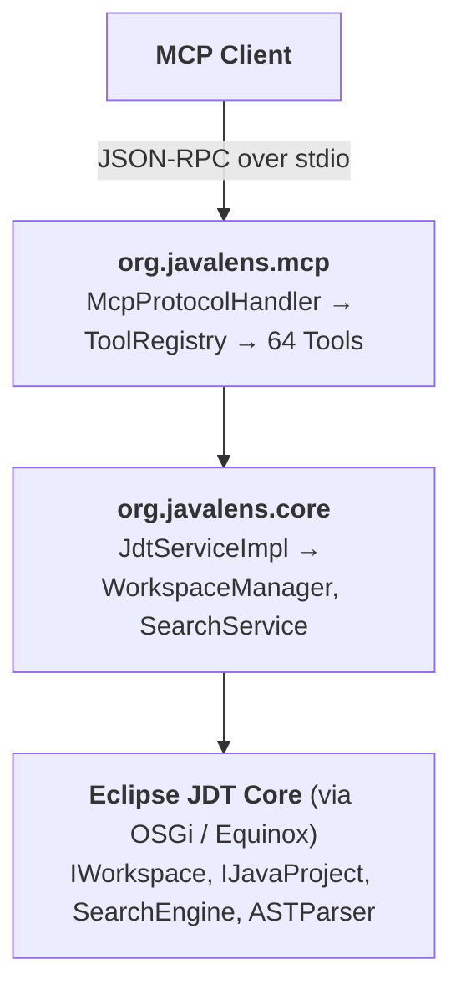

# JavaLens: AI-First Code Analysis for Java

[](https://github.com/pzalutski-pixel/javalens-mcp/releases)
[](LICENSE)
[](https://openjdk.org/projects/jdk/21/)

An MCP server providing 64 semantic analysis tools for Java, built directly on Eclipse JDT for compiler-accurate code understanding.

## Built for AI Agents

JavaLens exists because **AI systems need compiler-accurate insights that reading source files cannot provide**. When an AI uses `grep` or `Read` to find usages of a method, it cannot distinguish:

- A method call from a method with the same name in an unrelated class
- A field read from a field write
- An interface implementation from an unrelated class
- A cast to a type from other references to that type

This leads to incorrect refactorings, missed usages, and incomplete understanding of code behavior.

## Compiler-Accurate Analysis

JavaLens provides **compiler-accurate code analysis** through Eclipse JDT—the same engine that powers Eclipse IDE. Unlike text search, JDT understands:

- Type resolution across inheritance hierarchies
- Method overloading and overriding
- Generic type arguments
- Import resolution and classpath dependencies
- Java source from version 1.1 through **Java 25** (markdown Javadoc, module imports, compact source files, flexible constructor bodies)
- **Lombok**-generated members — a bundled agent makes `@Data` accessors and the like resolve, so code using them is not flagged as undefined

**Example:** Finding all places where `UserService.save()` is called:

| Approach | Result |
|----------|--------|
| `grep "save("` | Returns 47 matches including `orderService.save()`, `saveButton`, comments |
| `find_references` | Returns exactly 12 calls to `UserService.save()` |

## AI Training Bias Warning

> ⚠️ **Important for AI developers and users**

AI models may exhibit **trained bias toward native tools** (Grep, Read, LSP) over MCP server tools, even when semantic analysis provides better results. This happens because:

1. Training data contains extensive grep/text-search patterns
2. Native tools are "always available" in the model's experience
3. The model may not recognize when semantic analysis is superior

**To get the best results:**

Add guidance to your project instructions or system prompt (e.g., `CLAUDE.md` for Claude Code):

```markdown
## Code Analysis Preferences

For Java code analysis, prefer JavaLens MCP tools over text search:
- Use `find_references` instead of grep for finding usages
- Use `find_implementations` instead of text search for implementations
- Use `analyze_type` to understand a class before modifying it
- Use refactoring tools (rename_symbol, extract_method) for safe changes

Semantic analysis from JDT is more accurate than text-based search,
especially for overloaded methods, inheritance, and generic types.
```

## What is JavaLens?

JavaLens is an MCP server that gives AI assistants deep understanding of Java codebases. It provides semantic analysis, navigation, refactoring, and code intelligence tools that go beyond simple text search.

## Why Not LSP?

Language Server Protocol was designed for IDE autocomplete and basic navigation—not for AI agent workflows that require deep semantic analysis.

| Capability | Native LSP | JavaLens |
|------------|------------|----------|
| Find all `@Annotation` usages | ❌ | ✅ |
| Find all `new Type()` instantiations | ❌ | ✅ |
| Find all casts to a type | ❌ | ✅ |
| Distinguish field reads from writes | ❌ | ✅ |
| Detect circular package dependencies | ❌ | ✅ |
| Calculate cyclomatic complexity | ❌ | ✅ |
| Find unused private methods | ❌ | ✅ |
| Detect possible null pointer bugs | ❌ | ✅ |

JavaLens wraps **Eclipse JDT Core** directly via OSGi, providing:

- **Fine-grained reference types**: Find specifically casts, annotations, throws clauses, catch blocks, instanceof checks, method references, type arguments
- **Read vs write access distinction**: Track where fields are mutated vs just read
- **Indexed search**: JDT pre-builds an index at load time, so symbol/reference queries do not walk source files
- **Full AST access**: Direct manipulation for complex refactorings

## Installation

### Prerequisites

- **Java 21** or later (must be on PATH or set `JAVA_HOME`) — required for both install paths.
- **Node.js 18+** — required *only* if you use the npm/`npx` install path below. Skip if you use the direct-download path.

JavaLens is an analytical server, not a compiler. It uses Eclipse JDT 2025-12 to parse and understand Java source code from **version 1.1 through 25**. Java 21 is required only as the server runtime.

### Install from GitHub Releases (recommended — Java only)

This is the simplest path if you already have Java 21 and don't have Node.js. Download from [Releases](https://github.com/pzalutski-pixel/javalens-mcp/releases):

| Platform | File |
|----------|------|
| All platforms | `javalens.zip` or `javalens.tar.gz` |

Extract to a location of your choice (e.g., `/opt/javalens` or `C:\javalens`). Then point your MCP client at the bundled jar — see [Configure MCP Client](#configure-mcp-client) below.

### Install via npm (requires Node.js 18+)

If you already have Node.js, `npx` will download and cache the JavaLens distribution (~23 MB) on first run:

```json
{
  "mcpServers": {
    "javalens": {
      "command": "npx",
      "args": ["-y", "javalens-mcp"],
      "env": {
        "JAVA_PROJECT_PATH": "/path/to/your/java/project"
      }
    }
  }
}
```

### Configure MCP Client

Add to your MCP configuration (e.g., `.mcp.json` for Claude Code):

```json
{
  "mcpServers": {
    "javalens": {
      "command": "java",
      "args": ["-jar", "/path/to/javalens/javalens.jar", "-data", "/path/to/javalens-workspaces"]
    }
  }
}
```

The `-data` argument specifies where JavaLens stores its workspace metadata. See [How Workspaces Work](#how-workspaces-work) below.

### Auto-Load a Project

Set `JAVA_PROJECT_PATH` to auto-load a project when the server starts:

```json
{
  "mcpServers": {
    "javalens": {
      "command": "java",
      "args": ["-jar", "/path/to/javalens/javalens.jar", "-data", "/path/to/javalens-workspaces"],
      "env": {
        "JAVA_PROJECT_PATH": "/path/to/your/java/project"
      }
    }
  }
}
```

> **Note:** Project loading happens asynchronously in the background. The MCP server responds immediately while the project loads. Use `health_check` to monitor loading status—it will show `"project.status": "loading"` until complete, then `"loaded"` when ready.

## How Workspaces Work

Unlike in-memory code models, Eclipse JDT requires a **workspace directory** to store:

- Search indexes for fast symbol lookup
- Compilation state and caches
- Project metadata

### Workspaces Are Outside Your Source

JavaLens creates its workspace **outside your source project** to keep your codebase clean:

```
Your Java Project (unchanged)
├── src/main/java/
├── pom.xml
└── (no Eclipse files added)

JavaLens Workspace (specified by -data)
└── {session-uuid}/
    ├── .metadata/          <- JDT indexes and state
    └── javalens-project/   <- Links to your source (not copies)
```

**Why this matters:**

1. **No pollution**: Your source tree stays clean—no `.project` or `.classpath` files
2. **No conflicts**: Works alongside any build system without interference
3. **Session isolation**: Each MCP session gets its own workspace, enabling concurrent analysis

### Session Lifecycle

1. JavaLens starts and creates a unique workspace: `{base}/{uuid}/`
2. `load_project` creates linked folders pointing to your source
3. JDT builds indexes in the workspace (not in your project)
4. When the session ends, the workspace is cleaned up

## Tools

### Navigation (10 tools)

| Tool | Description |
|------|-------------|
| `search_symbols` | Search types, methods, fields by glob pattern |
| `go_to_definition` | Navigate to symbol definition |
| `find_references` | Find all usages of a symbol |
| `find_implementations` | Find interface/class implementations |
| `get_type_hierarchy` | Get inheritance chain |
| `get_document_symbols` | Get all symbols in a file |
| `get_symbol_info` | Get detailed symbol information at position |
| `get_type_at_position` | Get type details at cursor |
| `get_method_at_position` | Get method details at cursor |
| `get_field_at_position` | Get field details at cursor |

### Fine-Grained Reference Search (9 tools)

These use JDT's unique reference type constants—not available through LSP:

| Tool | Description |
|------|-------------|
| `find_annotation_usages` | Find all `@Annotation` usages |
| `find_type_instantiations` | Find all `new Type()` calls |
| `find_casts` | Find all `(Type) expr` casts |
| `find_instanceof_checks` | Find all `x instanceof Type` |
| `find_throws_declarations` | Find all `throws Exception` in signatures |
| `find_catch_blocks` | Find all `catch(Exception e)` blocks |
| `find_method_references` | Find all `Type::method` expressions |
| `find_type_arguments` | Find all `List<Type>` usages |
| `find_reflection_usage` | Find `Class.forName()`, `Method.invoke()`, and other reflection calls |

### Analysis (16 tools)

| Tool | Description |
|------|-------------|
| `get_diagnostics` | Get compilation errors and warnings |
| `validate_syntax` | Fast syntax-only validation |
| `get_call_hierarchy_incoming` | Find all callers of a method |
| `get_call_hierarchy_outgoing` | Find all methods called by a method |
| `find_field_writes` | Find where fields are mutated |
| `find_tests` | Discover JUnit/TestNG test methods |
| `find_unused_code` | Find unused private members |
| `find_possible_bugs` | Detect null risks, empty catches, resource leaks |
| `get_hover_info` | Get documentation/signature for symbol |
| `get_javadoc` | Get parsed Javadoc |
| `get_signature_help` | Get method signature at call site |
| `get_enclosing_element` | Get containing method/class at position |
| `analyze_change_impact` | Blast radius — all files and call sites affected by changing a symbol |
| `analyze_data_flow` | Variable read/write/declaration tracking within a method |
| `analyze_control_flow` | Branching, loops, return/throw points, nesting depth |
| `get_di_registrations` | Find Spring DI registrations (@Component, @Bean, @Autowired, @Inject) |

### Compound Analysis (4 tools)

Combine multiple queries to reduce round-trips:

| Tool | Description |
|------|-------------|
| `analyze_file` | Get imports, types, diagnostics in one call |
| `analyze_type` | Get members, hierarchy, usages, diagnostics |
| `analyze_method` | Get signature, callers, callees, overrides |
| `get_type_usage_summary` | Get instantiations, casts, instanceof counts |

### Refactoring (10 tools)

All refactoring tools return **text edits** rather than applying changes directly:

| Tool | Description |
|------|-------------|
| `rename_symbol` | Rename across entire project |
| `organize_imports` | Sort and clean imports |
| `extract_variable` | Extract expression to local variable |
| `extract_method` | Extract code block to new method |
| `extract_constant` | Extract to `static final` field |
| `extract_interface` | Create interface from class methods |
| `inline_variable` | Replace variable with its initializer |
| `inline_method` | Replace call with method body |
| `change_method_signature` | Modify params/return, update all callers |
| `convert_anonymous_to_lambda` | Convert anonymous class to lambda |

### Quick Fixes (4 tools)

| Tool | Description |
|------|-------------|
| `suggest_imports` | Find import candidates for unresolved type |
| `get_quick_fixes` | List available fixes for problem at position |
| `apply_quick_fix` | Apply fix by ID (add import, remove import, add throws, try-catch) |
| `apply_cleanup` | Apply a JDT clean-up (e.g. convert loops to enhanced for) and return rewritten source |

### Metrics (5 tools)

| Tool | Description |
|------|-------------|
| `get_complexity_metrics` | Cyclomatic/cognitive complexity, LOC per method |
| `get_dependency_graph` | Package/type dependencies as nodes and edges |
| `find_circular_dependencies` | Detect package cycles using Tarjan's SCC algorithm |
| `find_large_classes` | Find types exceeding method/field/line count thresholds |
| `find_naming_violations` | Check against Java naming conventions |

### Project & Infrastructure (6 tools)

| Tool | Description |
|------|-------------|
| `health_check` | Server status and capabilities |
| `load_project` | Load Maven/Gradle/Bazel/plain Java project |
| `get_project_structure` | Get package hierarchy |
| `get_classpath_info` | Get classpath entries |
| `get_type_members` | Get members by type name |
| `get_super_method` | Find overridden method in superclass |

## Usage

### Basic Workflow

```
1. load_project(projectPath="/path/to/java/project")
2. search_symbols(query="*Service", kind="Class")
3. find_references(filePath="...", line=10, column=15)
4. analyze_type(typeName="com.example.UserService")
```

### Coordinate System

All line/column parameters are **zero-based**:
- Line 0, Column 0 = first character of file

### Path Handling

- Response paths are **relative** by default
- All paths use **forward slashes** for cross-platform consistency
- Input paths can be relative or absolute

## Important Notes

### No Live File Watching

JavaLens analyzes code at load time and does **not** watch for file changes. This is by design—the AI coding agent is responsible for maintaining synchronization:

| Event | Agent Action |
|-------|--------------|
| After writing/editing files | Call `load_project` to refresh indexes |
| Before complex refactoring | Call `load_project` to ensure fresh state |
| After external changes (git pull, etc.) | Call `load_project` to resync |

**Why not automatic watching?**

1. AI agents make discrete edits with clear boundaries—auto-sync adds complexity without benefit
2. The agent controls when analysis should reflect changes
3. Avoids race conditions between file writes and index updates

**Recommended pattern:**
```
1. Use JavaLens tools to analyze
2. Write changes to files
3. Call load_project to refresh
4. Use JavaLens tools to verify changes
```

### Refactoring Returns Edits

Refactoring tools return text edits but don't modify files. This gives visibility into what would change before applying.

### Session Isolation

Each MCP session is independent with its own workspace UUID. Multiple sessions can analyze the same project concurrently.

### Build System Support

JavaLens loads three real build systems plus plain Java directories. Each is exercised end-to-end in CI against synthetic real-shaped fixtures (multi-module reactors with cross-module deps, real external libraries, annotation processors).

| System | Detection | Single-module | Multi-module / multi-project | Compiler compliance from build files | Generated sources | Annotation processors |
|--------|-----------|:-:|:-:|:-:|:-:|:-:|
| Maven | `pom.xml` | ✅ | ✅ (reactor classpath aggregation, cross-module navigation) | ✅ (`maven.compiler.release`/`source`/`target`) | ✅ (`target/generated-sources/*`) | ✅ (`<annotationProcessorPaths>` across the whole reactor) |
| Gradle | `build.gradle` / `build.gradle.kts` | ✅ | ✅ (`settings.gradle include` parsed; per-subproject classpaths unioned) | ✅ (`sourceCompatibility`) | ✅ (`build/generated/sources/<task>/main/java`) | ✅ (`annotationProcessor` configuration) |
| Bazel | `MODULE.bazel` / `WORKSPACE.bazel` / `WORKSPACE` | ✅ | ✅ (every `BUILD.bazel` package scanned for sources; `bazel-bin` ↔ `bazel-out` symlink dedup) | ✅ (`javacopts` `-source`/`-target`/`--release` parsed across `BUILD.bazel` files) | n/a (Bazel actions write into `bazel-bin/`, not `target/generated-sources/`) | ✅ (any classpath jar with `META-INF/services/javax.annotation.processing.Processor` is auto-registered) |
| Plain Java | `src/` directory | ✅ | n/a | ✅ (falls back to `Runtime.version().feature()` when no build file) | n/a | n/a |

Subprocess invocations of `mvn` / `gradle` happen during project load. If a tool is missing or fails, JavaLens surfaces a structured `LoadWarning` (e.g. `MAVEN_SUBPROCESS_FAILED`, `GRADLE_SUBPROCESS_FAILED`, `COMPLIANCE_LEVEL_UNKNOWN`) in the `load_project` response so callers know analysis quality is degraded rather than silently getting an empty classpath.

## Configuration

| Environment Variable | Description | Default |
|---------------------|-------------|---------|
| `JAVA_PROJECT_PATH` | Auto-load project on startup | (none) |
| `JAVALENS_TIMEOUT_SECONDS` | Operation timeout | 30 |
| `JAVALENS_LOG_LEVEL` | TRACE/DEBUG/INFO/WARN/ERROR | INFO |
| `JAVA_TOOL_OPTIONS` | JVM options, e.g. `-Xmx2g` for large projects | (default: 512m via eclipse.ini) |
| `JAVALENS_LOMBOK_JAR` | Path to the Lombok agent jar attached at launch; overrides the bundled one | (bundled) |

## Building from Source

```bash
git clone https://github.com/pzalutski-pixel/javalens-mcp.git
cd javalens-mcp
./mvnw clean verify
```

Distributions are output to `org.javalens.product/target/products/`.

### Build Requirements

- Java 21+ (server runtime)
- Maven 3.9+ (wrapper included as `./mvnw`)

To run the **full test suite** (which includes end-to-end tests against real Maven, Gradle, and Bazel builds), the corresponding tools must also be on `PATH`:

- Maven (provided by the wrapper)
- Gradle 8+
- Bazel 9+ (or `bazelisk`)

Tests gracefully skip when a tool is missing on a developer machine. Set `JAVALENS_TESTS_REQUIRE_TOOLS=true` to flip the gate: missing tools cause a hard failure instead of a skip. CI runs with this flag set so any provisioning gap surfaces as a real failure rather than weakening the suite silently.

### Testing

```bash
# Full suite, gentle (missing tools skip)
./mvnw verify

# Full suite, strict (missing tools fail; what CI does)
JAVALENS_TESTS_REQUIRE_TOOLS=true ./mvnw verify
```

Build-system coverage is structured as focused per-bug tests plus realistic end-to-end tests. The end-to-end tests load a single representative project per build system that exercises every fix in one pass — multi-module Maven with Lombok APT and cross-module references; multi-project Gradle with annotation processors; multi-target Bazel with cross-target deps. CI runs them on Linux, macOS, and Windows.

## Architecture



## License

MIT License - see [LICENSE](LICENSE) for details.
